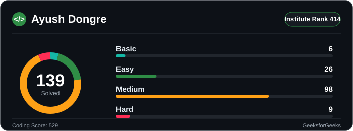

# 💫 About Me:
👨‍💻 IT student at PICT, Pune | Software Developer 🔧 Building full-stack & backend applications 🧠 Exploring DSA, System Design & scalable software 🚀 Always learning, building and improving

## 🌐 Socials:
    

# 💻 Tech Stack:

**Languages**
 
      

**Frontend**
 
       

**Backend**
 
       

**Databases**
 
    

**Cloud, DevOps & Tools**
 
            

**AI / ML & Data**
 
     

# 🧩 LeetCode Stats:

> 🔥 Track my daily problem-solving progress live on [LeetCode](https://leetcode.com/u/Ayush_Dongre_25/)

# 🟢 GeeksforGeeks Stats:

> 🌱 Also solving on [GeeksforGeeks](https://www.geeksforgeeks.org/profile/ayushdolkni)

# 🍥 CodeChef:

> ⚡ Also competing on [CodeChef](https://www.codechef.com/users/ayush_dongre)

---

<!-- Proudly created with GPRM ( https://gprm.itsvg.in ) -->
